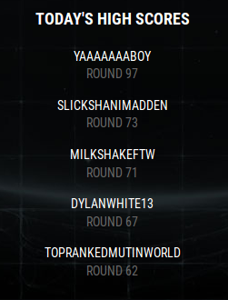

# Gauntlet_Bot

## Bot for Muthead Gauntlet, a Madden 18 Quiz game with a public scoreboard

## Getting Started

Install any python requirements by running:

```$ pip install -r requirements.txt```

Start the program by running:

```$ python main.py```

This will start a new selenium webdriver Firefox instance, which will navigate to the login page on the site


After logging into the site, respond the the CLI Prompt, and it will take you to the Gauntlet game page.

After hitting enter again, it will begin automating the browser window.


## Proof that everything works properly

### I am clearly Yaaaaaaaboy

[](#)